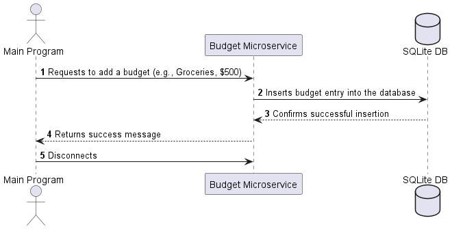
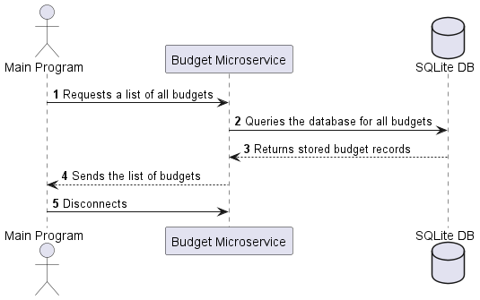
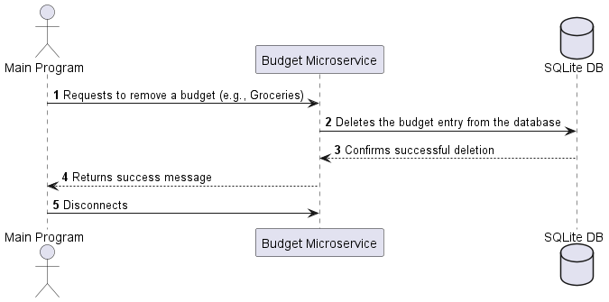

# Budget Microservice

This microservice provides a simple API for managing budget entries via **socket-based JSON communication**. It supports **adding budgets, retrieving all budgets, and removing budgets**.

## **How to Use This Microservice**
Your program must communicate with the microservice by sending **JSON-formatted requests** over a **TCP socket** connection. The microservice will process the request and return a JSON response.

### **Server Details**
- **Host:** `127.0.0.1`
- **Port:** `65432`
- **Protocol:** TCP
- **Request Format:** JSON

---

## **Request & Response Format**
### **1. Adding a Budget**
**Request Example:**
```json
{
    "action": "add_budget",
    "name": "Groceries",
    "amount": 500
}
```

**Response Example:**
```json
{
    "status": "success",
    "message": "Budget added successfully"
}
```

If the budget already exists:
```json
{
    "status": "error",
    "message": "Budget already exists"
}
```

### **2. Retrieving All Budgets**
**Request Example:**
```json
{
    "action": "get_budgets"
}
```

**Response Example:**
```json
[
    {"name": "Groceries", "amount": 500},
    {"name": "Rent", "amount": 1200},
    {"name": "Utilities", "amount": 200}
]
```

### **3. Removing a Budget**
**Request Example:**
```json
{
    "action": "remove_budget",
    "name": "Groceries"
}
```

**Response Example:**
```json
{
    "status": "success",
    "message": "Budget removed successfully"
}
```

If the budget does not exist:
```json
{
    "status": "error",
    "message": "Budget not found"
}
```

## UML Sequence Diagrams
The following sequence diagrams illustrate how the communication works between the client, the server, and the database.

1. **Adding a Budget**

    

2. **Retrieving Budgets**

    

3. **Removing a Budget**

    

(Diagrams are generated using [PlantUML](https://plantuml.com/))

## How to Connect to the Microservice

To interact with the microservice, establish a TCP socket connection, send a JSON request, and wait for a JSON response.

### Python Example
This Python snippet shows how to send a request and receive a response programmatically:
```python
import socket
import json

def send_request(request_data):
    client_socket = socket.socket(socket.AF_INET, socket.SOCK_STREAM)
    client_socket.connect(("127.0.0.1", 65432))
    client_socket.send(json.dumps(request_data).encode("utf-8"))
    response = client_socket.recv(1024).decode("utf-8")
    client_socket.close()
    return json.loads(response)

# Example: Add a budget
response = send_request({"action": "add_budget", "name": "Groceries", "amount": 500})
print(response)

# Example: Get all budgets
response = send_request({"action": "get_budgets"})
print(response)

# Example: Remove a budget
response = send_request({"action": "remove_budget", "name": "Groceries"})
print(response)
```
